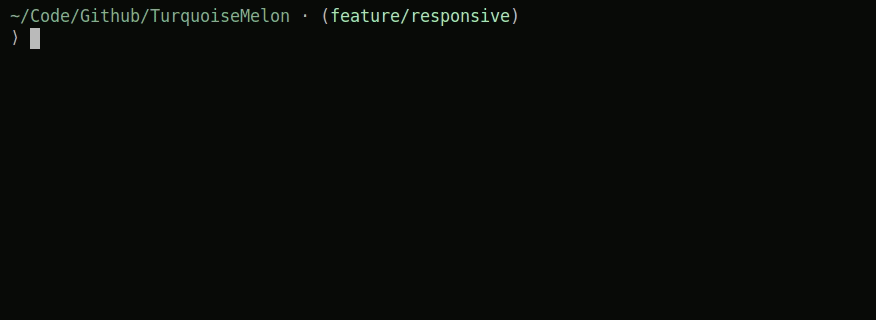

## TurquoiseMelon

Image ranking & tipping platform written in ReactJS, powered by Solidity Smart Contracts. All image-hashes and user-text reside on the Ethereum Blockchain, while the images themselves and code are hosted on Interplanetary Filesystem (IPFS), making it a _Fully Decentralized, Unstoppable, Censorship Resistant_ webapp. TurquoiseMelon is a NodeJS distributed application (Dapp) I built using front-end libraries like ReactJS, Web3JS & Walletconnect to interface with Smart Contracts and ExpressJS backend to provide a robust, decentralized web api. Ganache, Truffle & Remix IDE were used to develop and test on local blockchains prior to testnet & mainnet Ethereum deployment.

#### Issues

- [x] [Initialize Application](https://github.com/mbrassey/TurquoiseMelon/issues/1)
- [x] [Deploy to Local Blockchain & Test Smart Contract](https://github.com/mbrassey/TurquoiseMelon/issues/2)
- [x] [Add Main Components & Stylize](https://github.com/mbrassey/TurquoiseMelon/issues/3)
- [x] [Enhance Views w/React State & Extend Web3 Callbacks](https://github.com/mbrassey/TurquoiseMelon/issues/4)

#### Table of Contents

- [Requirements](#Requirements)
- [Installation](#Installation)
- [Usage](#Usage)
- [Screenshots](#Screenshots)
- [Developers](#Developers)
- [Questions](#Questions)
- [License](#License)

#### Requirements

    node
    npm
    ganache-cli

#### Installation

    npm i
    truffle test
    truffle migrate

#### Usage

    npm run start

<h6>
:cyclone: Click the image(s) below to view the live <a id="Screenshots" href="https://TurquoiseMelon-mbrassey.herokuapp.com/">webapplication</a>
</h6>

> Setup
> 

> Tests
> 

#### Questions

Contact me at [matt@brassey.io](mailto:matt@brassey.io) with any questions or comments.

#### License

`TurquoiseMelon` is published under the **CC0_1.0_Universal** license.

> The Creative Commons CC0 Public Domain Dedication waives copyright interest in a work you've created and dedicates it to the world-wide public domain. Use CC0 to opt out of copyright entirely and ensure your work has the widest reach. As with the Unlicense and typical software licenses, CC0 disclaims warranties. CC0 is very similar to the Unlicense.
